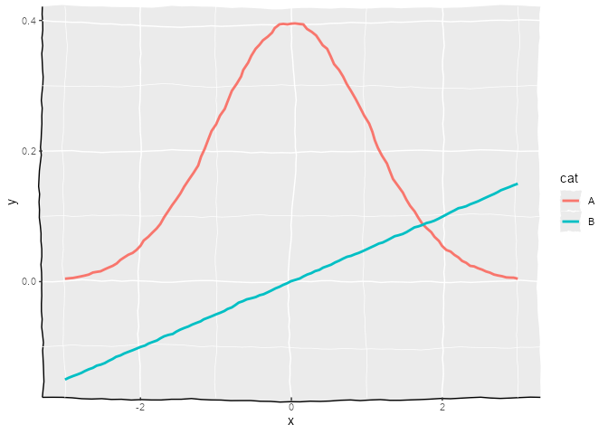
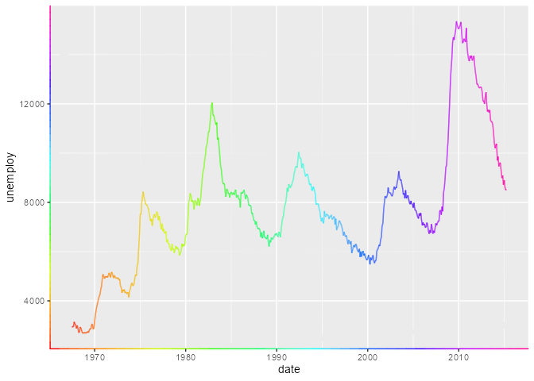

<!-- README.md is generated from README.Rmd. Please edit that file -->

# elementalist 

<!-- badges: start -->

[](https://travis-ci.com/teunbrand/elementalist)
[](https://codecov.io/gh/teunbrand/elementalist?branch=master)
[](https://www.tidyverse.org/lifecycle/#experimental)
<!-- badges: end -->

The goal of elementalist is to provide extra, fun theme elements for the
ggplot2 plotting library. This is mostly a pet project for fun.

## Installation

You can install the development version from
[GitHub](https://github.com/) with:

``` r
devtools::install_github("teunbrand/elementalist")
```

## Example

Here is an example how you can make your elements wiggle\!

``` r
library(elementalist)
#> Loading required package: ggplot2

x <- seq(-3, 3, length.out = 20)
df <- data.frame(
  x = c(x, x),
  y = c(dnorm(x, sd = 1), c(x)/20),
  cat = rep(LETTERS[1:2], each = 20)
)

ggplot(df, aes(x, y, colour = cat)) +
  geom_line_theme(size = 2) +
  coord_cartesian(clip = "off") +
  theme(
    elementalist.geom_line = element_line_wiggle(6, n = 6),
    panel.background = element_rect_wiggle(sides = c("lb"),
                                           colour = "black"),
    panel.grid.major = element_line_wiggle(3),
    panel.grid.minor = element_line_wiggle(3)
  )
```



Here is how you can make them colour gradients. It defaults to rainbow
colours, but you can set your own.

``` r
ggplot(pressure, aes(temperature, pressure)) +
  geom_line_theme() +
  theme(
    elementalist.geom_line = element_line_multicolour(),
    axis.line = element_line_multicolour()
  )
```



This package is still in the experimental phase. Expect some bugs here
and there and use at your own risk\!
